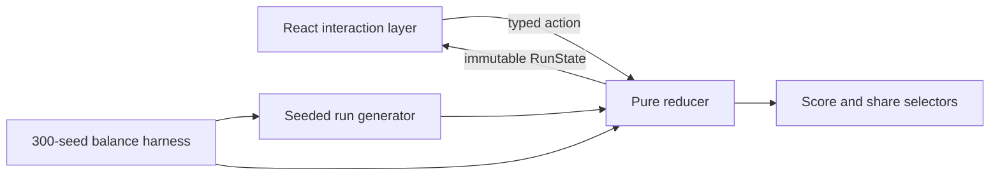

# Draw Desk

Draw Desk is a deterministic construction-draw review game. You decide whether to fund or hold payment requests while balancing three competing outcomes: verified progress, loan exposure, and contractor goodwill.

[Play the live game](https://rsimmons2021.github.io/draw-day/) · [View the source](https://github.com/RSimmons2021/draw-day)

## Product frame

Construction lenders cannot optimize for speed alone. Rubber-stamping a draw can release cash against work that does not exist; holding every questionable request can starve an honest project. Draw Desk turns that operating tension into a five-minute decision loop:

1. Read a contractor’s cumulative claim and prior payment position.
2. Weigh weak, noisy evidence from inspections, photos, sequencing, materials, waivers, and track record.
3. Fund verified work or return the request for correction.
4. Watch the facility, exposure, progress, and goodwill respond.
5. At closeout, reveal ground truth and audit every decision.

The game does not reveal correctness during play. That keeps the workflow honest and gives every input mode—including screen readers—the same information.

The visual direction studies General Magic’s Magic Cap “place” metaphor, then reinterprets it for a construction-finance field office. All interface artwork, objects, and interaction details in the project are original.

## Architecture



The boundaries are deliberate:

| Layer | Responsibility | Why it matters |
| --- | --- | --- |
| `src/engine/generate.ts` | Seeded contractors, trade schedules, claims, and evidence | Every run is reproducible without fixtures or network state. |
| `src/engine/reducer.ts` | Funding, holds, retainage, resubmissions, exposure, and terminal states | Business rules are pure, typed, and testable outside React. |
| `src/engine/score.ts` | Closeout metrics and spoiler-free sharing | Presentation does not recalculate domain truth. |
| `src/ui/*` | Input, responsive composition, state feedback, and accessible output | The interface consumes the model rather than owning it. |

This prototype does not need a backend to prove its core risk. For a production multiplayer or account-backed version, I would keep this domain package intact, make the server authoritative for seeds and decisions, persist an append-only decision event stream in Postgres, and derive read models for the web and React Native clients. That preserves feature alignment without duplicating business rules in each surface.

## Product and interaction decisions

- **The interface is a place, not a skin.** An original field-office metaphor turns routes into the desk, draw tray, and file room; payments become clipped applications; decisions become stamps; and history becomes a file drawer. The visual language explains the workflow instead of decorating it.
- **Delight is earned at meaningful moments.** Hard shadows, paper movement, and stamped receipts respond to opening, deciding, and closing out. Financial scanning and input latency remain primary, with no ambient animation or novelty controls.
- **Evidence stays probabilistic.** No single common warning guarantees fraud. Balance tests verify that reading the whole file beats “hold on any red flag.”
- **Consequences are structural.** Funding unbuilt work creates a second bill; refusing honest work consumes goodwill. The game does not rely on arbitrary score deductions.
- **The daily seed is reproducible.** Everyone receives the same local-date queue, while practice projects use fresh seeds.
- **Feedback does not leak answers.** The UI confirms cash and workflow impact immediately, then reveals claim-versus-reality only in the final audit.
- **Desktop and mobile reprioritize.** Desktop keeps the decision trail and limits beside the file. Mobile stacks the same semantic regions after the primary decision controls.
- **Motion carries causality.** Cards track pointer movement and exit toward the chosen action. Reduced-motion users receive the same state change without spatial travel.
- **Access is part of the contract.** Touch, pointer, left/right keyboard shortcuts, visible focus, live announcements, semantic progress, 48 px targets, and reduced motion are built into the loop.

## Verification strategy

The repository currently has 70 behavioral tests across five suites:

- deterministic and bounded random generation;
- trade graph, claim ladder, and evidence invariants;
- immutable reducer transitions and every terminal path;
- scoring, capital leakage, and spoiler-free sharing;
- 300 seeded balance simulations that compare perfect play, blanket funding, blanket holds, red-flag reflexes, and error-rate cohorts.

The balance suite is product validation in executable form. It proves that perfect judgment always closes out, simplistic strategies fail, evidence points in the intended direction, and higher accuracy improves outcomes monotonically.

```bash
npm ci
npm test
npm run build
```

Every push to `main` runs type-checking and tests before GitHub Pages can deploy. The deployment job uses a clean install and a production Vite build.

## Tradeoffs and extension points

- **Scope:** this is a decision simulator, not underwriting guidance or a replica of any lender’s policy.
- **Persistence:** daily runs intentionally reset on refresh. If completion rate became a product goal, the first extension would be versioned local persistence with a visible restart action—not an account gate before value.
- **Observability:** a production release would instrument briefing-to-start conversion, evidence dwell time, decision latency, abandonment by draw, strategy clusters, and closeout/replay rates without logging hidden answers before the run ends.
- **Content operations:** evidence copy is typed and centralized. A larger catalog would add schema validation, content versioning, and seed compatibility so old shared runs remain reproducible.
- **Platform parity:** the pure engine is ready to be consumed by a React Native shell; gestures and visual composition can stay platform-native while the rules and fixtures remain shared.

## Local development

```bash
npm install
npm run dev
```

The project uses TypeScript, React, Vite, and Vitest. It intentionally adds no runtime state, styling, animation, or component dependencies; the current scope is clearer and smaller without them.
